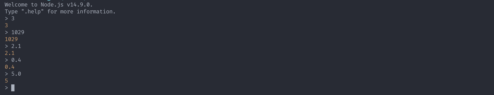
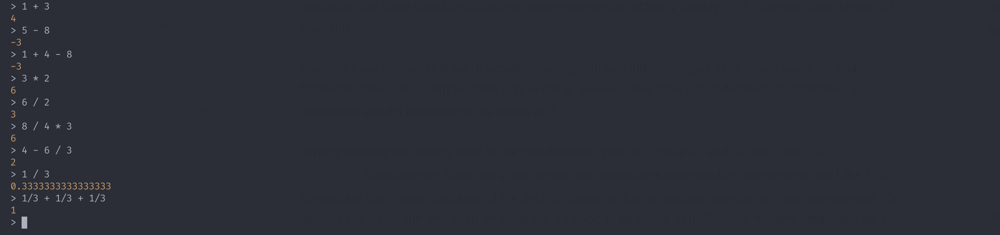
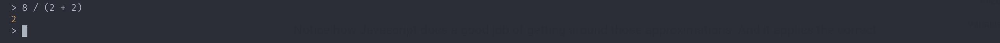
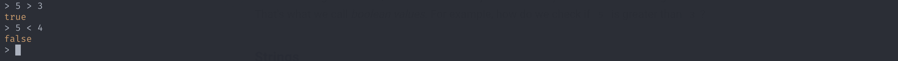
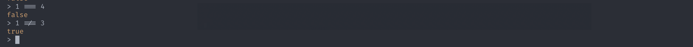
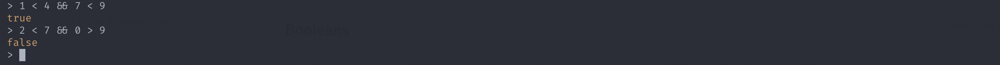
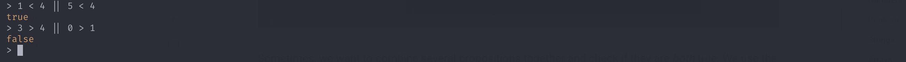

# 01 - Data types & operations

## Data Types & Operations

In the previous section we talked how programming is how we define and automate behaviours.

A common example is a calculator; programming it means we define what happens when we press, for instance, the addition button. But that behaviour by itself is useless, we need to provide it some numbers so it actually does something_._ That's our _data_ and, in this case, their _type_ is _number._

Data types are important as they allow us to specify constraints on our behaviours. It makes no sense to add text together, so we tell the computer that addition works only with numbers. 

Different programming languages have different base data types or even different ways to express them but, in general, these concepts are universal.

So let's boot up [Node](../01.intro/02-development-environment.md) and try out the different Javascript types!

### Numbers

Let's try just writing some numbers in the interpreter

Notice how when you type in `5.0`, it automatically converts it to `5`. This makes as the extra `.0` is redundant but there could be situations where you want to actually display `5.0`. So why does Javascript does this?

You may have noticed that we're actually dealing with two different types here: whole numbers and fractional ones. Javascript bundles it all under a `Number` data type, but underneath it still makes a distinction and it's important to be aware of it. 

In programming we usually refer to the two different types as `Integer` and `Float` , for [floating point arithmetic](https://en.wikipedia.org/wiki/Floating-point_arithmetic). Sounds scary but it really just means that computers have trouble representing stuff like$$1/3$$. Computers can't really calculate all the decimal cases as it is an endless number, so they approximate. It's unlikely you'll ever run into such an issue but it's good to be aware of it. Besides, modern languages do a good job of hiding such issues.

So let's take a look at how that works. Let's try to do some calculations! 

Notice how Javascript does a good job of getting around those approximations. And it applies the correct priority rules. We can, of course, just wrap your expressions in parenthesis.

### Booleans

Numbers are great and all, but sometimes we just want to say or check if something is _true_ or _false_. That's what we call _boolean values._ For example, let's check if some number is greater than another.

We can also check for equality or inequality

Sometimes, we want to combine several propositions together and check if they are _both_ true. We use the `&&` \(read _and_\) operator.

Conversely, we may want to check if at least one of the propositions is true. We use the `||` \(read _or_\) operator for that.

### Strings

### Arrays

### Objects

### null and undefined

## Functions

### Recursive functions

## Variables

